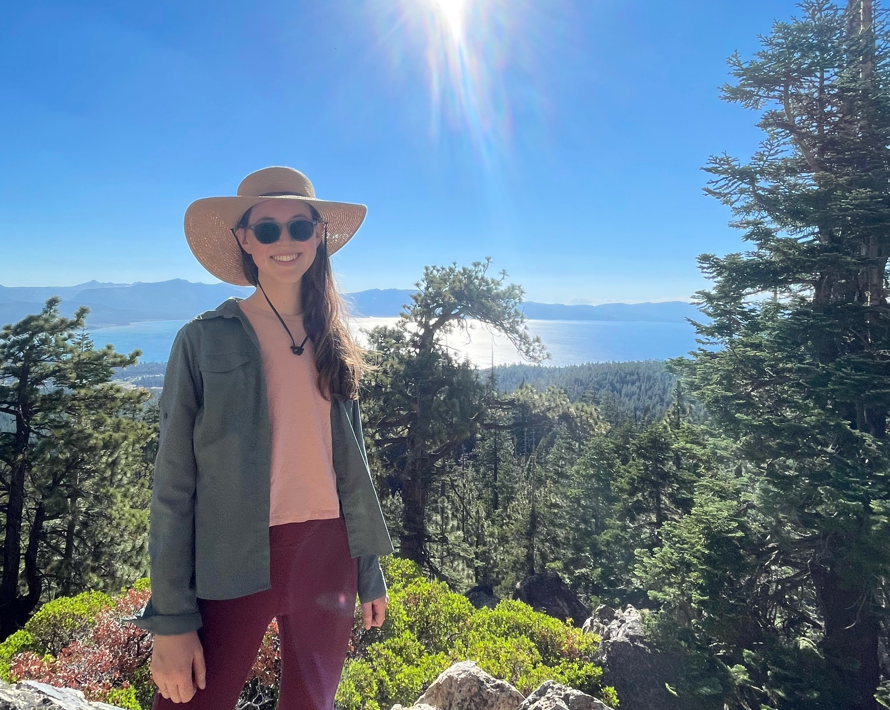

 

### *Hello!* 

 

{width=500px}

 
I am an ORISE Postdoctoral Fellow with the US Forest Service Rocky Mountain Research Station, working with the Biodiversity Research and Policy Center. I am a member of the working group "Beyond the historical baseline: Management for biodiversity conservation in changed ecosystems."

I completed my PhD at the University of California, Davis in the <a href="http://ecology.ucdavis.edu/">Graduate Group in Ecology</a>, where I worked with <a href="http://jin.ucdavis.edu"> Dr. Yufang Jin </a> and <a href="https://safford.ucdavis.edu/"> Dr. Hugh Safford</a>.  My dissertation focused on remote sensing applications for forest and fire ecology, including biomass mapping in subalpine forests of the Sierra Nevada and producing an open-source fire severity mapping tool in Google Earth Engine. 

Although much of my graduate work focused on forest structure and composition, my initial experiences in ecology centered on restoration and endangered species. In multiple positions with the National Park Service, I investigated how restoration practices influence plant communities. These projects highlighted the complex interplay of grazing, climate shifts, Indigenous management practices, and invasive species—ultimately motivating me to pursue ecology with a focus on improving public land management under climate change. Following my time with the NPS, I worked as a lab manager for Claire Kremen at UC Berkeley, where I studied native bee community assembly and conservation within agroecosystems.

 

{width=500px}

 

I am also interested in working with people to move forward into a healthier relationship with fire. I believe it is important to expand outreach and communication to the public about fire and forest systems in California. Beyond that, I believe for our collective societal relationship with fire to improve, we must focus on empowering communities and developing programs that meet their needs where they are. An essential part of this is facilitating cultural burning led by Indigenous fire practitioners. I have been fortunate to attend cultural burns led by Honorable Chairman Ron Goode and am committed to improving conditions for Indigenous fire practitioners in my work after graduate school. I also am fireline trained as an FFT2 and attended a TREX program in 2020 led by Fire Forward in Sonoma County. Community-led and participatory programs like that are an amazing way to spread the word about good fire.

 

<!-- start wrap -->

<!-- image -->
  <!-- keep that size -->

<!-- text -->

Here I am looking stoked with a beautiful red-fir cone in one of our plots. They're hard to find because animals devour them quickly! Along with teaching geospatial class labs, I was a TA for 9 quarters of plant-identification
classes, where I led students around campus looking at trees and plants of the urban forest and arboretum. I love leading outdoor labs and sharing my love for plants with students.

<!-- end wrap -->